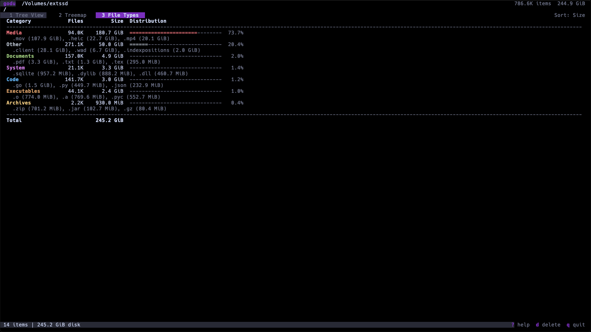
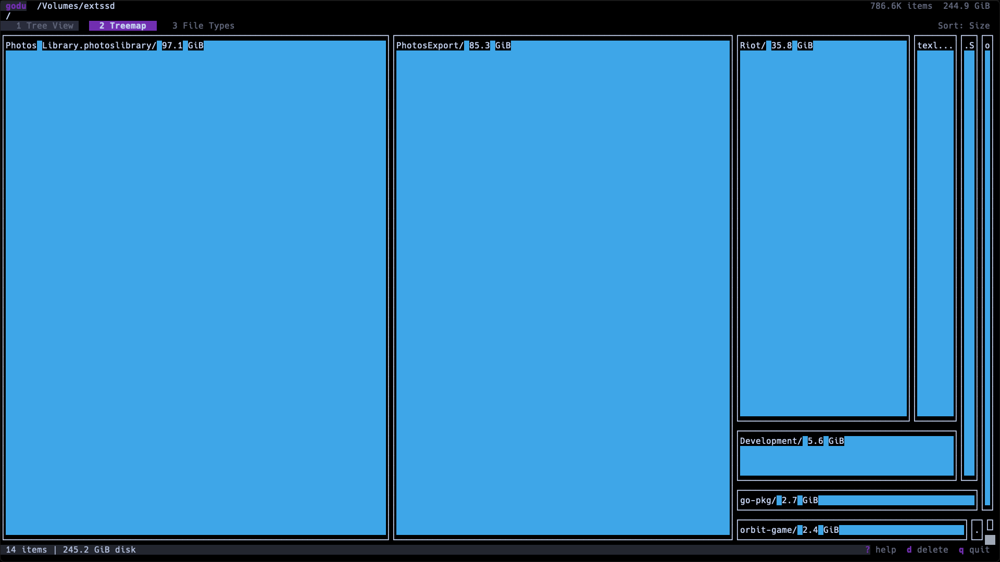
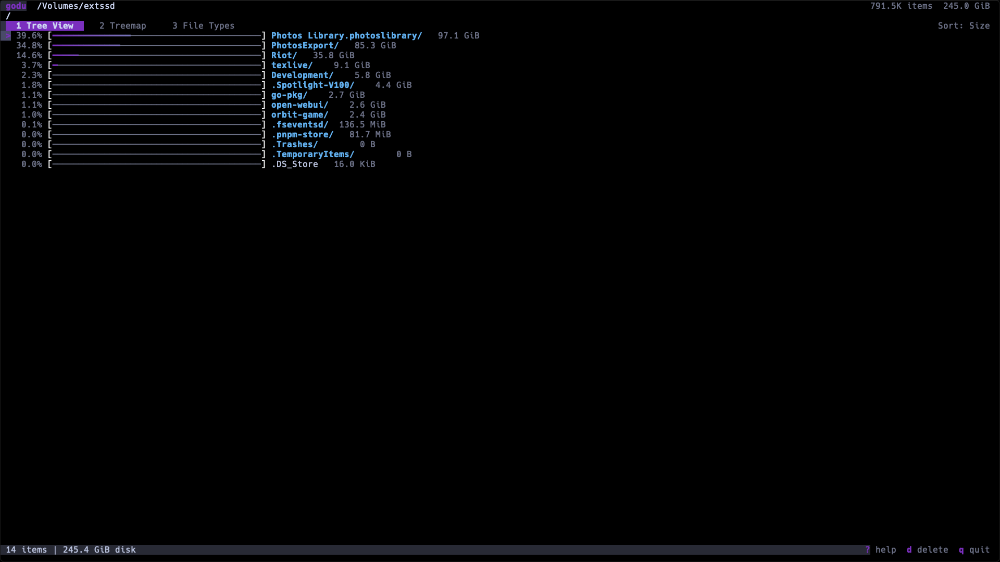
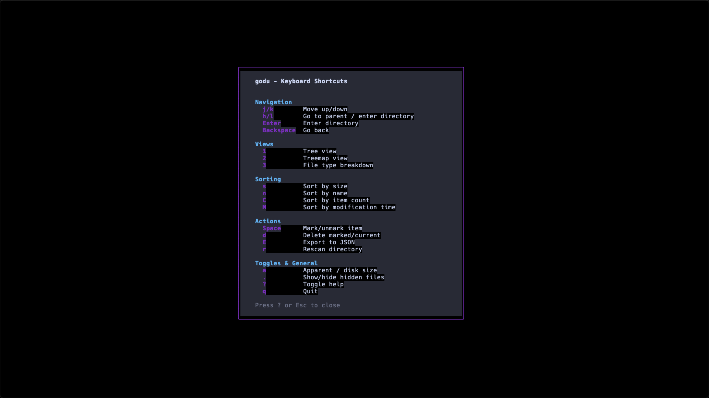

# godu

A fast, interactive disk usage analyzer for the terminal. Think **ncdu** meets **WinDirStat** — built in Go with a modern TUI.

godu combines parallel scanning speed, visual treemap analysis, file type breakdowns, and safe file deletion into a single tool.



## Features

- **Parallel scanning** — goroutine-per-directory with semaphore, scans 500K+ files in under a second on SSD
- **3 view modes** — tree list, squarified treemap, file type breakdown
- **Gradient bars** — purple-to-teal color gradient showing relative sizes
- **Safe deletion** — mark files with Space, review, confirm, then delete
- **Export/Import** — save scan results to JSON, reload later without rescanning
- **Vim keybindings** — `hjkl` navigation, feels natural
- **Responsive layout** — adapts to any terminal size
- **Zero dependencies** — single static binary, no CGo, no networking

## Screenshots

### Tree View
Sorted file listing with percentage bars, size columns, and directory navigation.


### Treemap
Squarified treemap visualization using Unicode box-drawing characters. Rectangles sized proportionally to disk usage.



### File Types
Breakdown by category (Media, Code, Archives, Documents, System, Executables) with top extensions per category.



### Help
Full keybinding reference overlay.



## Installation

### Homebrew (macOS / Linux)

```bash
brew tap sadopc/tap
brew install godu
```

### From source

Requires **Go 1.21+**.

```bash
# Clone the repository
git clone https://github.com/serdar/godu.git
cd godu

# Build
go build -o godu ./cmd/godu

# Or install directly to your GOPATH/bin
go install ./cmd/godu
```

### Add to PATH

After `go install`, the binary is at `~/go/bin/godu`. Make sure `~/go/bin` is on your PATH:

```bash
# Add to your shell profile (~/.zshrc, ~/.bashrc, etc.)
export PATH="$HOME/go/bin:$PATH"

# Reload your shell
source ~/.zshrc   # or ~/.bashrc
```

Now you can run `godu` from anywhere.

### Using Make

```bash
make build      # Build binary in current directory
make install    # Install to GOPATH/bin
make release    # Cross-compile for macOS and Linux (amd64 + arm64)
```

## Usage

```bash
# Scan current directory
godu

# Scan a specific path
godu /home

# Scan showing hidden files (default)
godu --hidden /path

# Scan hiding hidden files
godu --no-hidden /path

# Export scan results to JSON (headless, no TUI)
godu --export scan.json /path

# Import and browse a previous scan
godu --import scan.json

# Disable GC during scan (faster, uses more memory)
godu --no-gc /large/directory

# Exclude directories
godu --exclude node_modules,.git /project

# Show version
godu --version
```

## Keybindings

### Navigation

| Key | Action |
|-----|--------|
| `j` / `↓` | Move cursor down |
| `k` / `↑` | Move cursor up |
| `l` / `→` / `Enter` | Enter directory |
| `h` / `←` / `Backspace` | Go to parent |

### Views

| Key | Action |
|-----|--------|
| `1` | Tree view (default) |
| `2` | Treemap view |
| `3` | File type breakdown |

### Sorting

| Key | Action |
|-----|--------|
| `s` | Sort by size |
| `n` | Sort by name |
| `C` | Sort by item count |
| `M` | Sort by modification time |

### Actions

| Key | Action |
|-----|--------|
| `Space` | Mark/unmark item |
| `d` | Delete marked items (with confirmation) |
| `E` | Export scan to JSON |
| `r` | Rescan directory |
| `a` | Toggle apparent size / disk usage |
| `.` | Toggle hidden files |
| `?` | Show help |
| `q` | Quit |
| `Ctrl+C` | Force quit |

## How It Works

### Scanning

godu uses a parallel directory walker. Each subdirectory spawns a goroutine (bounded by a semaphore of `3 * GOMAXPROCS`) to maximize I/O throughput. Sizes are calculated bottom-up after the full tree is built, avoiding race conditions.

Hardlinks are detected via inode tracking to prevent double-counting. Symlinks are flagged but not followed by default.

### Data Model

The file tree is stored in memory as `DirNode` and `FileNode` structs. Paths are reconstructed by walking parent pointers rather than stored per-node, saving significant memory at scale. Each node tracks both apparent size (file content) and disk usage (allocated blocks).

### Treemap

The treemap uses a squarified layout algorithm adapted for character cells. Rectangles are drawn with Unicode box-drawing characters (`┌─┐│└┘`) and colored by file category. Labels are placed inside rectangles when they fit, truncated with `...` when they don't.

### Export Format

Scan results export as nested JSON arrays compatible with ncdu's format:

```json
[1,0,{"progname":"godu","progver":"dev","timestamp":1234567890},
  [{"name":"/path"},
    {"name":"file.txt","asize":1024,"dsize":4096},
    [{"name":"subdir"},
      {"name":"inner.go","asize":512,"dsize":4096}
    ]
  ]
]
```

## Project Structure

```
godu/
├── cmd/godu/main.go              # CLI entry point
├── internal/
│   ├── model/
│   │   ├── tree.go               # FileNode, DirNode, TreeNode interface
│   │   ├── sort.go               # Multi-field sorting
│   │   └── filetype.go           # Extension-to-category mapping (150+)
│   ├── scanner/
│   │   ├── scanner.go            # Scanner interface, options
│   │   ├── parallel.go           # Parallel directory walker
│   │   └── progress.go           # Progress reporting
│   ├── ui/
│   │   ├── app.go                # Root Bubble Tea model
│   │   ├── keys.go               # Key bindings
│   │   ├── style/
│   │   │   ├── theme.go          # Colors, gradients, styles
│   │   │   └── layout.go         # Responsive layout calculations
│   │   └── components/
│   │       ├── treeview.go       # Tree list with gradient bars
│   │       ├── treemap.go        # Squarified treemap
│   │       ├── filetypes.go      # File type breakdown
│   │       ├── header.go         # Header + breadcrumb
│   │       ├── statusbar.go      # Status bar + tab bar
│   │       ├── scanprogress.go   # Scanning overlay
│   │       ├── confirm.go        # Delete confirmation dialog
│   │       └── help.go           # Help overlay
│   ├── ops/
│   │   ├── delete.go             # File deletion
│   │   ├── export.go             # JSON export
│   │   └── import.go             # JSON import
│   └── util/
│       ├── format.go             # Size/count formatting
│       └── icons.go              # Unicode icons
├── screenshots/                  # README screenshots
├── Makefile
├── go.mod
└── go.sum
```

## Dependencies

| Package | Purpose |
|---------|---------|
| [bubbletea](https://github.com/charmbracelet/bubbletea) | TUI framework (Elm architecture) |
| [lipgloss](https://github.com/charmbracelet/lipgloss) | Terminal styling |
| [bubbles](https://github.com/charmbracelet/bubbles) | Key binding helpers |
| [go-colorful](https://github.com/lucasb-eyer/go-colorful) | Gradient color interpolation |
| [natural](https://github.com/maruel/natural) | Natural string sorting |

No CGo. No database. No networking. Compiles to a single static binary.

## Performance

Tested on Apple Silicon Mac Mini with SSD:

| Directory | Files | Time |
|-----------|-------|------|
| 56K files | 56,000 | 0.29s |
| Home dir | 413,000 | ~1s |
| Large SSD | 786,000 | ~2s |

## License

[MIT](LICENSE)
